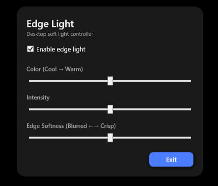
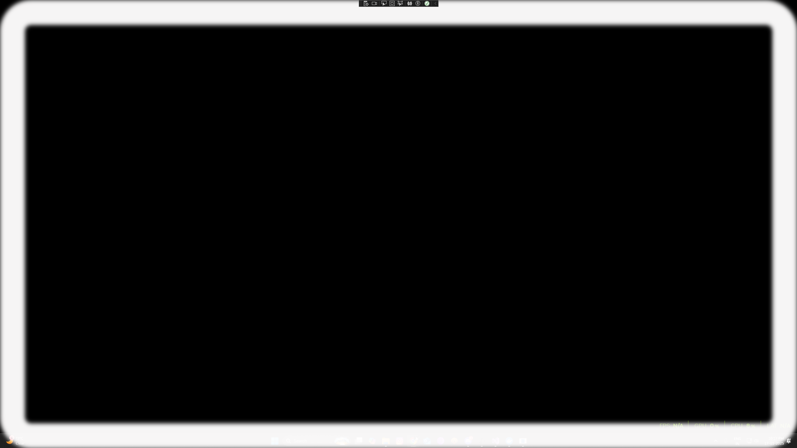
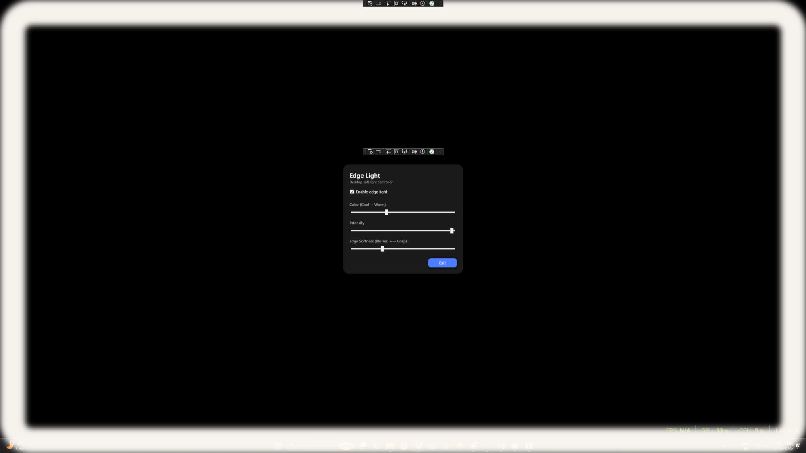

# ✨ **Digital Ring Light**

_A lightweight, modern desktop tool that adds a soft light border around your display._

**Digital Ring Light** is a Windows desktop application built in **C# (.NET 8, WPF)** that creates a subtle, customizable light frame around your screen.  
It acts like a **virtual ring light**, improving your appearance during video calls, recordings, and low-light environments using only your monitor — no hardware required.

* * *

## 🌟 Features

### 🔆 Customizable Soft Light Frame

A Fullscreen transparent overlay displays a glowing rectangular light border around your screen.  
Perfect for illuminating your face while keeping your work visible.

### 🎚 Adjustable Controls

The floating control panel lets you adjust:

*   **Color Temperature** → Slide between cool white ↔ warm white
*   **Intensity** → Dim ↔ bright output
*   **Edge Softness** → Blurred glow ↔ sharp crisp border
*   **Enable/Disable Toggle** → Instantly turn the virtual ring light on/off

### 🖥 Modern Floating Control Panel

A minimal, dark-themed control window with:

*   Rounded corners
*   Soft shadows
*   No window chrome
*   Completely transparent background
*   Smooth interactions

* * *

## 🖼 Screenshots

> _(Add your screenshots here)_

`📸 Screenshot — Floating control panel`  

<figure class="image"></figure>

`📸 Screenshot — Virtual ring light overlay`  

<figure class="image"></figure>

`📸 Screenshot — Light customization in action`  

<figure class="image"></figure>

* * *

## 🎥 Demo Video

> _(Add your demo link here)_

`▶️ Demo – Digital Ring Light usage & preview`

<figure class="image"></figure>

* * *

## 🏗 Technology Stack

*   **C# .NET 8**
*   **WPF (Windows Presentation Foundation)**
*   **Real-time UI event handling**
*   **Transparent Windows**
*   **Dynamic blur effects**
*   **Overlay window rendering**

* * *

# 🔧 How It Works

### Overlay Window

A Fullscreen transparent WPF window renders only a border with:

*   SolidColorBrush (color)
*   Opacity-based intensity
*   BlurEffect (softness)

### Control Panel

A separate floating panel controls everything in real-time via simple event-driven updates.

* * *

# 🚀 Future Enhancements (Planned)

### 1\. **Invisible During Screen Sharing**

Implementing Win32’s:

`SetWindowDisplayAffinity(..., WDA_EXCLUDEFROMCAPTURE)`

So the virtual light will be **visible only to you**, not captured by screen recorders or video conference apps.

### 2\. **Click-Through Light Frame**

Letting mouse clicks pass through the overlay without blocking interaction.

### 3\. **Multi-Monitor Support**

Choose which monitor should display the digital ring light.

### 4\. **Color Presets**

Add prebuilt lighting modes:

*   Soft daylight
*   Warm studio
*   Natural white
*   Cinematic glow

### 5\. **Auto Light Adjustment**

Use webcam/ambient-light sensing to automatically adjust intensity.

### 6\. **System Tray App**

Allow quick toggles and presets without opening the full UI.

* * *

# 📥 Installation

### Clone or download:

`git clone https://github.com/yourusername/DigitalRingLight cd DigitalRingLight`

### Run (Debug Mode)

Open the solution in Visual Studio and press **F5**.

### Requirements

*   Windows 10 or 11
*   .NET 8 Runtime
*   GPU recommended for smoother softness effects

* * *

# 🤝 Contributing

Contributions, ideas, and feedback are welcome.  
Feel free to submit pull requests or open issues.

* * *

# 📄 License

**MIT License** – free for personal and commercial use.